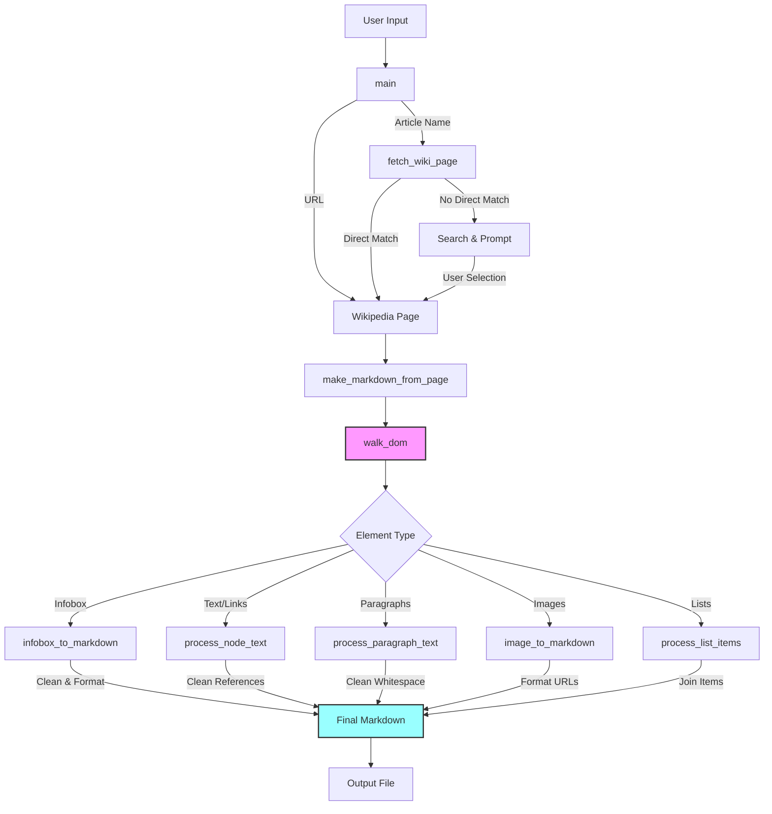

# 🌐 wikipedia2md

[](https://github.com/poiley/wikipedia2md/actions/workflows/tests.yml)

[](https://coveralls.io/github/poiley/wikipedia2md?branch=main)

[](LICENSE)  

[](https://www.python.org/downloads/release/python-370/)

  

  

Convert Wikipedia articles to Markdown files

## 📚 Table of Contents

| Section | Description |
|---------|-------------|
| [🚀 Installation](#-installation) | How to install the tool |
| [🎯 Overview](#-overview) | What the tool does and who it's for |
| [💻 Command Line Usage](#-command-line-usage) | How to use the command line interface |
| [🛠️ Code Structure](#️-code-structure) | Technical details of how the code works |
| [🧹 Code Style Guidelines](#-code-style-guidelines) | Coding conventions and standards |
| [🤝 Contributing](#-contributing) | How to contribute to the project |
| [🧪 Testing](#-testing) | How to run the test suite |
| [🔮 Obsidian Support](#-obsidian-support) | Special features for Obsidian users |
| [📄 License](#-license) | License information |

## 🚀 Installation

### From Source
```bash
# Clone the repository and navigate to the project directory
git clone https://github.com/poiley/wikipedia2md.git wikipedia2md && cd wikipedia2md

# Install in development mode
pip install -e .
```

### Requirements
- Python 3.7+
- pip (Python package installer)

## 🎯 Overview

Wikipedia2MD is a Python tool that transforms Wikipedia articles into well-formatted Markdown files. Perfect for:
- 📝 Content creators
- 🎓 Researchers
- 📚 Knowledge collectors
- 🤖 Automation enthusiasts

## 💻 Command Line Usage

```bash
# Basic usage - converts article to markdown
wikipedia2md "Article Name"

# Save to specific output directory
wikipedia2md "Article Name" -o ./output/

# Convert article using Wikipedia URL
wikipedia2md --url "https://wikipedia.org/wiki/Python_(programming_language)"

# Combine multiple options
wikipedia2md "Article Name" -O -N -o ./obsidian/ -L DEBUG

# Get help
wikipedia2md --help
```

### Available Options

| Flag | Long Form | Description |
|------|-----------|-------------|
| `-o` | `--output-dir` | Directory to save the markdown file (default: current directory) |
| `-u` | `--url` | Convert article directly from a Wikipedia URL |
| `-O` | `--obsidian` | Enable Obsidian mode with YAML frontmatter |
| `-N` | `--no-links` | Disable links in the output |
| `-v` | `--verbose` | Enable verbose output for debugging |
| `-L` | `--loglevel` | Set logging level (DEBUG, INFO, WARNING, ERROR, CRITICAL) |

## 🛠️ Code Structure



The application follows a clear logical flow for converting Wikipedia articles to Markdown:

1. **Command Processing** (`main`)
   - Handles CLI arguments and initializes logging
   - Orchestrates the overall conversion process

2. **Article Retrieval** (`fetch_wiki_page`)
   - Attempts direct page lookup first
   - Falls back to search with user interaction if needed
   - Handles disambiguation and error cases

3. **Markdown Conversion** (`make_markdown_from_page`)
   - Core conversion function that processes the Wikipedia HTML
   - Manages document structure and formatting
   - Optionally adds Obsidian frontmatter

4. **Element Processing**
   - Specialized handlers for different content types:
     - `infobox_to_markdown`: Converts Wikipedia infoboxes to markdown tables
     - `process_node_text`: Handles text nodes with potential links
     - `process_paragraph_text`: Manages paragraph formatting
     - Various helper functions for links, images, and text cleaning

The flow ensures clean, well-formatted Markdown output while preserving the structure and content of the original Wikipedia article.

## 🧹 Code Style Guidelines

We follow these conventions to keep our code clean and maintainable:

1. 📏 **PEP 8** - Follow Python's style guide
2. 🔤 **Docstrings** - All functions and classes must have descriptive docstrings
3. 🎯 **Type Hints** - Use Python type hints for better code clarity
4. 📝 **Comments** - Write clear, concise comments for complex logic
5. ✨ **Black** - Use Black formatter for consistent code style

## 🤝 Contributing

Contributions are welcome! Please feel free to submit a Pull Request.

1. Fork the repository
2. Create your feature branch (`git checkout -b feature/AmazingFeature`)
3. Commit your changes (`git commit -m 'Add some AmazingFeature'`)
4. Push to the branch (`git push origin feature/AmazingFeature`)
5. Open a Pull Request

## 🧪 Testing

To run the tests:

```bash
# Install test requirements
pip install -r tests/requirements-test.txt

# Run tests
pytest tests/

# Run tests with coverage report
pytest tests/ --cov=wikipedia2md
```

## 🔮 Obsidian Support

Wikipedia2MD includes special support for [Obsidian](https://obsidian.md), the powerful knowledge base that works on top of a local folder of plain text Markdown files.

When using the `-O` or `--obsidian` flag, the tool will:

1. Add YAML frontmatter to the generated markdown files
2. Include metadata such as:
   - Original Wikipedia URL
   - Date of conversion
   - Article title
   - Categories (from Wikipedia's category system)
3. Format internal links in a way that's compatible with Obsidian's wiki-style linking

Example YAML frontmatter:
```yaml
---
title: "Python (programming language)"
wikipedia_url: "https://en.wikipedia.org/wiki/Python_(programming_language)"
date_converted: "2024-02-20 15:30:00"
tags:
  - Programming languages
  - High-level programming languages
  - Object-oriented programming languages
  - Python (programming language)
  - Cross-platform software
  - Dutch inventions
  - Class-based programming languages
  - Programming languages created in 1991
---
```

Example usage:
```bash
# Convert article with Obsidian support
wikipedia2md "Python (programming language)" -O

# Combine with output directory for your vault
wikipedia2md "Python (programming language)" -O -o ./vault/Programming/
```

This makes it easy to build your Obsidian knowledge base with high-quality Wikipedia content while maintaining proper linking and metadata. The YAML frontmatter enables powerful features in Obsidian like:
- 🔍 Better search capabilities
- 🏷️ Category-based organization
- 🔗 Automatic backlinks
- 📑 Multiple aliases for the same note

## 📄 License

This project is licensed under the MIT License - see the LICENSE file for details.
