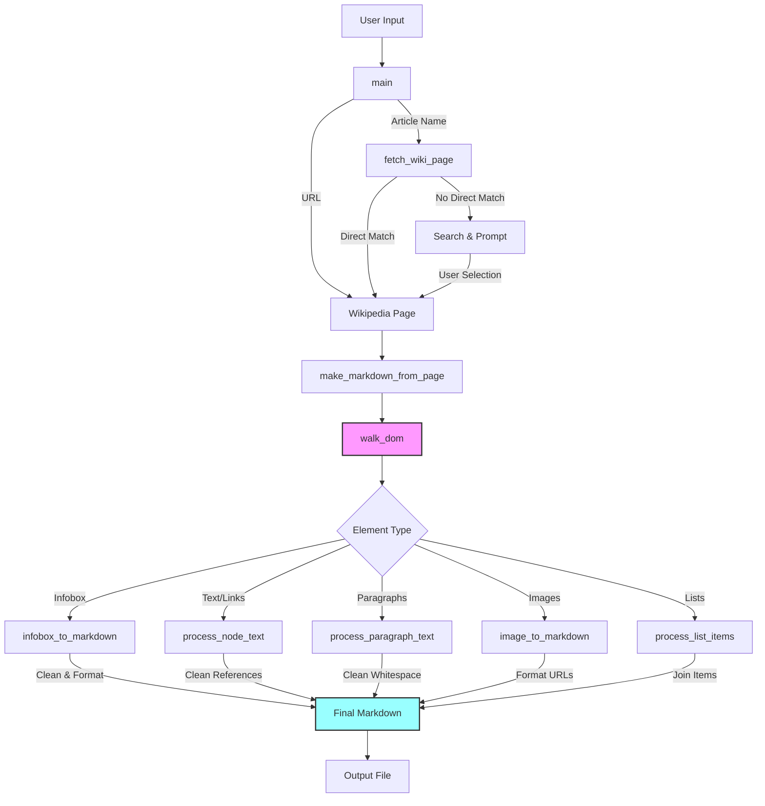

# 🌐 wikipedia2md - CLI tool to convert Wikipedia articles to markdown

[](https://github.com/poiley/wikipedia2md/actions/workflows/tests.yml)
[](https://coveralls.io/github/poiley/wikipedia2md?branch=main)


Convert Wikipedia articles to beautiful Markdown files with ease! 📚

## 📚 Table of Contents

| Section | Description |
|---------|-------------|
| [🚀 Installation](#-installation) | How to install the tool |
| [🎯 Overview](#-overview) | What the tool does and who it's for |
| [💻 Command Line Usage](#-command-line-usage) | How to use the command line interface |
| [🛠️ Code Structure](#️-code-structure) | Technical details of how the code works |
| [🧹 Code Style Guidelines](#-code-style-guidelines) | Coding conventions and standards |
| [🤝 Contributing](#-contributing) | How to contribute to the project |
| [🧪 Testing](#-testing) | How to run the test suite |
| [🔮 Obsidian Support](#-obsidian-support) | Special features for Obsidian users |
| [📄 License](#-license) | License information |

## 🚀 Installation

### From Source
```bash
# Clone the repository and navigate to the project directory
git clone https://github.com/poiley/wikipedia2md.git wikipedia2md && cd wikipedia2md

# Install in development mode
pip install -e .
```

### Requirements
- Python 3.7+
- pip (Python package installer)

## 🎯 Overview

Wikipedia2MD is a Python tool that transforms Wikipedia articles into well-formatted Markdown files. Perfect for:
- 📝 Content creators
- 🎓 Researchers
- 📚 Knowledge collectors
- 🤖 Automation enthusiasts

## 💻 Command Line Usage

```bash
# Basic usage - converts article to markdown
wikipedia2md "Article Name"

# Save to specific output directory
wikipedia2md "Article Name" -o ./output/

# Convert article using Wikipedia URL
wikipedia2md --url "https://wikipedia.org/wiki/Python_(programming_language)"

# Combine multiple options
wikipedia2md "Article Name" -O -N -o ./obsidian/ -L DEBUG

# Get help
wikipedia2md --help
```

### Available Options

| Flag | Long Form | Description |
|------|-----------|-------------|
| `-o` | `--output-dir` | Directory to save the markdown file (default: current directory) |
| `-u` | `--url` | Convert article directly from a Wikipedia URL |
| `-O` | `--obsidian` | Enable Obsidian mode with YAML frontmatter |
| `-N` | `--no-links` | Disable links in the output |
| `-v` | `--verbose` | Enable verbose output for debugging |
| `-L` | `--loglevel` | Set logging level (DEBUG, INFO, WARNING, ERROR, CRITICAL) |

## 🛠️ Code Structure



The application follows a clear logical flow for converting Wikipedia articles to Markdown:

1. **Command Processing** (`main`)
   - Handles CLI arguments and initializes logging
   - Orchestrates the overall conversion process

2. **Article Retrieval** (`# wikipedia2md
